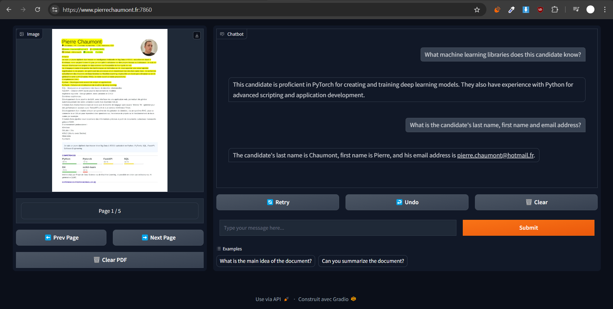

<div align="center">
    <h1 style="font-size: large; font-weight: bold;">Chat PDF</h1>
    <a href="#">
        
    </a>
    <a href="#">
        
    </a>
  <br>
</div>

## Presentation

This project is example Chat-PDF, a web application that lets you chat with any PDF. This project uses LangChain for the
prompt engineering, Gradio for the web user interface and Gradio to create the CLI for production.



## Installation

This project use poetry, to install the dependencies, you can run the following command:

```bash
poetry install
```

## Usage

To run the project, you can use the following command:

```bash
poetry run python src
```

## Structure

```bash
├── src               # Project source code
├── docs              # Project documentation
│   └── static        # README.md static files
├── tests             # Folder containing software tests
│   ├── units         # Unit tests
│   └── integrations  # Integration tests
├── scripts           # Useful scripts for the project (no CI/CD)
├── ruff.toml         # Ruff configuration file
├── environment.yml   # Conda environment configuration file
```

## Installation

This project requires **conda** to be installed. To install the dependencies, simply run the following command:

```bash
conda env create -f environment.yml
```

You can update the environment with the following command:

```bash
conda env update -f environment.yml
```

## Usage

This project uses `typer` to create a command-line interface. To launch command help, simply issue the following command
the following command:

```bash
python src
```

## Docker

### Docker-compose

This project have a `docker-compose.yml` file to run the project in production. To run the project, you can use the
following command:

```bash
docker-compose up --build -d
```

### Manual

First, you must create the volume who allow Airflow to access to Gradio's 'db' folder contains the PDF content in vector

```bash
docker volume create shared_db_volume
```

To build the Docker image, you can run the following command:

```bash
docker build -t chat_pdf .
```

### Gradio app

To build the Dockerfile, you can use the following command:

```bash
docker build -t gradio_chat_pdf .
```

To run the Docker container, you can use the following command:

- `d`: Mode daemon
- `p`: Port to use
- `v`: set volume for Airflow container (clear the db folder)
- `name`: give name to container and don't have random name

```bash
docker run -d --name gradio_chat_pdf -v shared_db_volume:/app/db -p 7860:7860 gradio_chat_pdf
```

### Airflow app

To build the Dockerfile, go to `airflow` folder and use the following command:

```bash
docker build -t airflow_chat_pdf .
```

To run the Docker container, you can use the following command:

- `d`: Mode daemon
- `p`: Port to use
- `v`: set volume for Airflow container (clear the db folder)
- `name`: give name to container and don't have random name

```bash
docker run -d --name airflow_chat_pdf -v shared_db_volume:/opt/airflow/db -p 8080:8080 airflow_chat_pdf
```

### Tips & Other

For debugging purposes, you can run the following command:

```bash
docker run -it -p 7860:7860 xxxx_chat_pdf /bin/bash
```

For deleting all Docker containers, you can use the following command:

```bash
docker rm -f $(docker ps -a -q)
```

For deleting all Docker images, you can use the following command:

```bash
docker rmi -f $(docker images -q)
```

## Airflow

This project uses Apache Airflow to schedule the data processing. To start the Airflow web server, you can run the
following command:

```bash
airflow db init
airflow db migrate
```

Create an admin user:

```bash
airflow users create \
    --username admin \
    --firstname FIRST_NAME \
    --lastname LAST_NAME \
    --role Admin \
    --email admin@example.com \
    --password admin
```
To start the Airflow web server in development, you can run the following command:

```bash
airflow standalone
```

To start the Airflow web server in production, you can run the following command:

```bash
airflow webserver --port 8080 --daemon
airflow scheduler --daemon
```